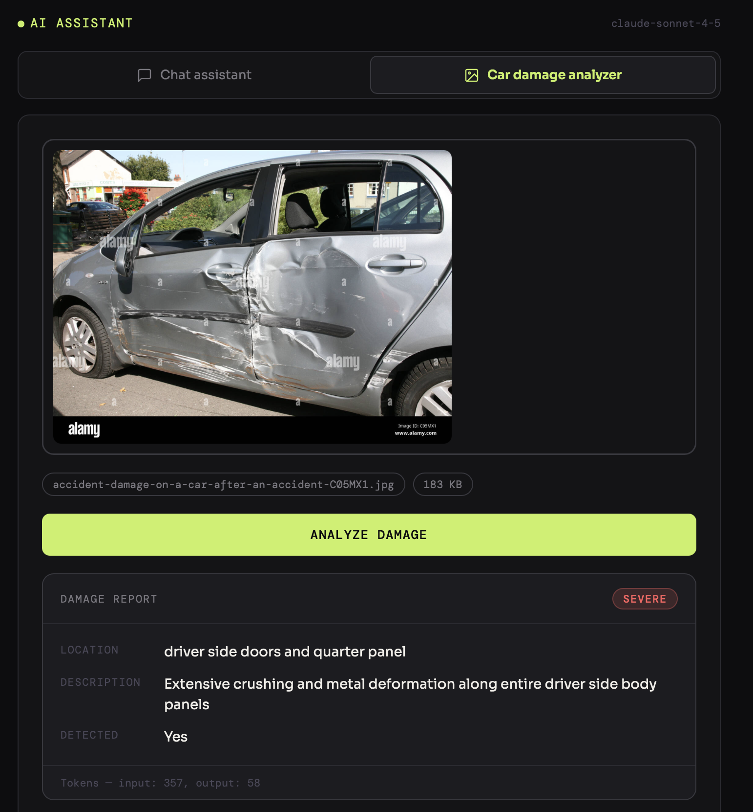

# AI Assistant — Spring Boot + LLM Integration

A Spring Boot REST API with two AI-powered features:
- **Chat Assistant** — ask any question, get an instant answer powered by Claude
- **Car Damage Analyzer** — upload a car photo, get a structured damage report with location, severity, and description

---

## Demo



> Severe damage detected on driver side doors and quarter panel — only 357 input tokens used after image resizing and OpenCV cropping.

---

## Features

### Chat Assistant
- Send any question to Claude and get an AI-generated answer
- Clean chat UI with typing indicator and message history
- Powered by `claude-sonnet-4-5` via Anthropic API

### Car Damage Analyzer
- Upload any car image (JPG, PNG, WEBP up to 10MB)
- Image is automatically resized to 512px to reduce token usage
- OpenCV detects the damage region and crops to it before sending to AI
- Returns structured report: damage location, severity, description
- Token usage displayed on every result

### Token Optimization
| Technique | Saving |
|-----------|--------|
| Resize image to 512px | ~80% fewer image tokens |
| OpenCV crop to damage region | ~60% fewer tokens on top |
| `max_tokens: 150` output cap | Short, structured responses only |
| Focused JSON system prompt | No rambling, predictable output |

---

## Tech Stack

- **Java 17**
- **Spring Boot 3.2**
- **Anthropic Claude API** (`claude-sonnet-4-5`)
- **OpenCV 4.7** — damage region detection
- **imgscalr** — image resizing
- **Maven** — build tool
- **HTML / CSS / JS** — frontend (no framework)

---

## Project Structure

```
AI_query_assistant/
│
├── pom.xml
├── .env                   ← API key (never commit)
├── .env.example
├── .gitignore
├── README.md
├── docs/
│   └── demo.png           ← screenshot
│
└── src/main/
    ├── java/com/example/aiassistant/
    │   ├── AiAssistantApplication.java
    │   ├── config/
    │   │   └── AppConfig.java
    │   ├── controller/
    │   │   ├── ChatController.java          ← POST /api/ask
    │   │   └── DamageController.java        ← POST /api/analyze
    │   ├── service/
    │   │   ├── AnthropicService.java        ← chat LLM calls
    │   │   ├── AnthropicVisionService.java  ← vision LLM calls
    │   │   └── ImageProcessingService.java  ← resize + OpenCV crop
    │   └── model/
    │       ├── ChatRequest.java
    │       ├── ChatResponse.java
    │       └── DamageResponse.java
    └── resources/
        ├── application.yml
        └── static/
            └── index.html                   ← unified UI with tab switcher
```

---

## Prerequisites

- [Java 17+](https://adoptium.net)
- [Maven 3.8+](https://maven.apache.org/install.html)
- An [Anthropic API key](https://console.anthropic.com)

```bash
java -version
mvn -version
```

---

## Getting Started

### 1. Clone the repository

```bash
git clone https://github.com/your-username/ai-query-assistant.git
cd ai-query-assistant
```

### 2. Set up your API key

```bash
cp .env.example .env
```

Open `.env` and add your key:
```
ANTHROPIC_API_KEY=sk-ant-xxxxxxxxxxxxxxxx
```

> ⚠️ Never commit `.env` — it is already in `.gitignore`.

### 3. Build and run

```bash
export $(cat .env | xargs) && mvn clean package -DskipTests && mvn spring-boot:run
```

### 4. Open in browser

```
http://localhost:8080
```

---

## API Reference

### Chat — `POST /api/ask`

```bash
curl -X POST http://localhost:8080/api/ask \
  -H "Content-Type: application/json" \
  -d '{"question": "What is Spring Boot?"}'
```

Response:
```json
{
  "answer": "Spring Boot is a framework that simplifies building Java applications..."
}
```

---

### Car Damage — `POST /api/analyze`

```bash
curl -X POST http://localhost:8080/api/analyze \
  -F "image=@/path/to/car.jpg"
```

Response:
```json
{
  "damageLocation": "driver side doors and quarter panel",
  "severity": "severe",
  "description": "Extensive crushing and metal deformation along entire driver side body panels",
  "damageDetected": true,
  "tokensUsed": "input: 357, output: 58"
}
```

---

## Configuration

`src/main/resources/application.yml`:

```yaml
server:
  port: 8080

spring:
  servlet:
    multipart:
      max-file-size: 10MB
      max-request-size: 10MB

anthropic:
  api:
    key: ${ANTHROPIC_API_KEY}
  model: claude-sonnet-4-5
```

---

## Environment Variables

| Variable | Description | Required |
|----------|-------------|----------|
| `ANTHROPIC_API_KEY` | Your Anthropic API key | ✅ Yes |

---

## How It Works

### Chat flow
1. User types a question in the Chat tab
2. `ChatController` receives `POST /api/ask`
3. `AnthropicService` calls the Anthropic API
4. Answer is returned and displayed in the chat bubble

### Damage analysis flow
1. User uploads a car image in the Damage Analyzer tab
2. `DamageController` receives `POST /api/analyze`
3. `ImageProcessingService` resizes to 512px and uses OpenCV to detect and crop the damage region
4. `AnthropicVisionService` sends the cropped image with a focused prompt (`max_tokens: 150`)
5. Structured JSON response is parsed and displayed as a damage report

---

## Common Issues

| Problem | Fix |
|---------|-----|
| `401 Unauthorized` | Check `ANTHROPIC_API_KEY` is set correctly |
| `Port 8080 in use` | Change `server.port` in `application.yml` |
| `BUILD FAILURE` | Run Maven from the root folder (where `pom.xml` is) |
| Slow first response | Normal — JVM warms up after the first request |
| Image upload fails | Check `max-file-size` in `application.yml` |

---

## Deployment

Recommended free hosting: **Railway**

1. Push code to GitHub
2. Go to [railway.app](https://railway.app) → New Project → Deploy from GitHub
3. Add environment variable: `ANTHROPIC_API_KEY=sk-ant-...`
4. Railway auto-detects Spring Boot and gives you a live URL

---

## Resume Entry

**AI Assistant — Spring Boot + LLM Integration**
- Developed a Spring Boot REST API integrating the Anthropic Claude API for both text chat and vision-based car damage analysis
- Built an image processing pipeline using OpenCV and imgscalr to resize, detect damage regions, and crop images before sending to the vision model — reducing token usage by ~80%
- Implemented prompt engineering with a structured JSON system prompt and `max_tokens` cap to produce concise, predictable AI output
- Designed a unified single-page frontend with tab switching between chat and damage analyzer modes
- Secured API credentials using environment variables; deployed via Railway

---

## License

MIT License — free to use for learning or as a portfolio project.